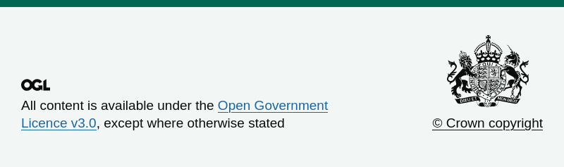

# ATE Frontend

Active Travel England templates and styles for the web.

## Compatibility

The following version matrix details the compatibility between this project and other frontend components:

| ATE Frontend       | GOV.UK Frontend | GOV.UK One Login Service Header     |
|--------------------|-----------------|-------------------------------------|
| 0.1.0 (unreleased) | 6.1.0           | 5.0.0 (uses GOV.UK Frontend 5.13.0) |

## Components

This project provides the following components.

### ATE header

The ATE header component tell users that they're using an ATE service. It replaces the GOV.UK logo in the GOV.UK header
with the ATE logo.


Use with the Nunjucks macro:

```nunjucks


{{ ateHeader({}) }}
```

The macro supports all the [GOV.UK header](https://design-system.service.gov.uk/components/header/) options, plus:

| Name        | Type   | Description                                |
|-------------|--------|--------------------------------------------|
| `assetPath` | string | Specify a path to the ATE Frontend assets. |

### ATE footer

The ATE footer component provides copyright, licensing and other information about your service. It removes the GOV.UK
logo from the GOV.UK footer.



Use with the Nunjucks macro:

```nunjucks


{{ ateFooter({}) }}
```

The macro supports all the [GOV.UK footer](https://design-system.service.gov.uk/components/footer/) options.

### ATE service header

The ATE service header component tell users that they're logged into an ATE service. It replaces the GOV.UK logo in the
GOV.UK One Login service header with the ATE logo.


Use with the Nunjucks macro:

```nunjucks


{{ ateServiceHeader({}) }}
```

The macro supports all the [GOV.UK One Login service header](https://github.com/govuk-one-login/service-header) options,
plus:

| Name        | Type   | Description                                |
|-------------|--------|--------------------------------------------|
| `assetPath` | string | Specify a path to the ATE Frontend assets. |

## Using with the Prototype Kit

This project can also be used as a plugin for the [GOV.UK Prototype Kit](https://prototype-kit.service.gov.uk/).

### Templates

Templates are used to create pages. This plugin provides the following templates:

* Blank ATE page - uses the ATE header and footer
* Blank ATE service page - uses the ATE service header and footer

Learn how to [create pages from templates](https://prototype-kit.service.gov.uk/docs/create-pages-from-templates) in a prototype.

### Layouts

Layouts are used to share a common design across pages. This plugin provides the following layouts:

* `ate/layouts/prototype/template.njk` - uses the ATE header and footer
* `ate/layouts/prototype/service-template.njk` - uses the ATE service header and footer

These layouts support all the [GOV.UK page template](https://design-system.service.gov.uk/styles/page-template/#template-blocks-and-options)
blocks and options, specifically:

| Name                | Type     | Description                                                                                      |
|---------------------|----------|--------------------------------------------------------------------------------------------------|
| `opengraphImageUrl` | Variable | Specify an absolute URL to the ATE Frontend Open Graph image `ate-icons/ate-opengraph-image.png` |
| `themeColor`        | Variable | Defaults to the DfT organisation colour                                                          |

Learn [how to use layouts](https://prototype-kit.service.gov.uk/docs/how-to-use-layouts) in a prototype.

## See also

* [Design files](design/README.md)
* [Maintenance](docs/maintenance.md)
* [Releasing](docs/releasing.md)

## Licence

[MIT License](LICENCE)
